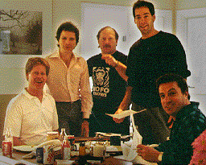

# Month 1 - C#
Once the closed-source staple of enterprise Windows applications and web monoliths, C# has evolved into a lightweight, cross-platform and scalable programming language with a growing community of open source contributors.

C# is a general purpose, multi-paradigm programming language and has run-times available for Mac OSX, Windows and Linux.

---

# What can I build with it?
Web apps, services, CLIs, serverless components, games (Unity's preferred scripting language is C#), Windows desktop applications and more.

---

# What do I need to get started?
- The **dotnet core** SDK

  [Download the SDK from Microsoft](https://dotnet.microsoft.com/download) before you do anything else. This will give you the dotnet CLI (command line interpreter), and all the other tooling you'll need to get going.

- An IDE

  [Go and get Visual Studio Code.](https://code.visualstudio.com/) It is properly good.

---

# History
To really understand the history of C#, we need to take a step back in time to the year 1990...

It was a year that saw cinema screens _rocked_ by the smouldering hair cuts of Demi Moore and Patrick Swayze. A year that the UK's Prime Minister Margaret Thatcher stepped down shortly after having introduced the _wildly_ popular Poll Tax. It was the year that the Hubble Space Telescope was launched from the space shuttle Discovery - propelling \$1.5 billion of NASA technology to a modest altitude of some 340 miles above Earth.

But even more impressive, even more _profoundly important_ - In a small town in California, a crack group of nerds had given birth to a C-based Form Generator known as **Ruby** (no not that Ruby).

<p align="center">

</p>

Immediately snaffled up by Bill Gates as a "cool" extension to one of their ongoing in-house projects (the outrageously-named **Project Thunder**) - **Visual Basic** was introduced to baying hordes of ListBox enthusiasts at the Atlanta World Trade Show in the spring of 1991.

<p align="center">

</p>

Whilst there were numerous languages preceding Visual Basic that enabled devs to create Guis; this was the first time that a "drag 'n' drop" simplicity had been extended to an enterprise-y development environment. Not only could you now piece together multiple screens based off discrete components, but with its introduction of _Events_; you could easily create callback methods which would be executed on the click of a button/scroll of a ListBox:

```vb
' mmmm ListBoxes
Private Sub List1_Click()
    Print "Clicked - " & Me.List1.List(Me.List1.ListIndex)
End Sub
```

Visual Basic would go on to have a shelf-life of some 18 more years before it was finally put out to pasture but, with its origins so deeply entrenched in the Windows API, its spirit continues to live on today.

## The .NET Framework
A somewhat rambling introduction to what I was aiming to be quite a _techy_ publication; but I thought a bit of history might be jolly before jumping straight into the language proper.

In 2002 Microsoft released the first candidate of the .NET Framework for Windows XP (Service Pack 1). Along with the Visual Studio .NET IDE which contained a bunch of redesigned **PROJECT THUNDER** components (let's not forget those listboxes); .NET Framework 1.0 provided a CLR for their new flagship languages:

- VB .NET
- C# .NET

What's a CLR I hear you ask? From the horse's mouth

> "[the] common language runtime, which runs the code and provides services that make the development process easier."

Put simply, the common language runtime is the virtual machine component of the .NET Framework and is responsible for actually executing your application. Code written in either VB .NET or C# .NET are both compiled to IL (intermediate language, or "byte code"), and executed by the CLR.

As for C#? This had been in development since 1999 by one of Borland's chief architects **Anders Hejlsberg**, as a C-Like Object Oriented Language. I literally just found out this was to be called **PROJECT COOL (C-Like Object Oriented Language)** before pesky copyright legislation got in the way. To think I may otherwise have been able to advertise myself as a COOL Developer to any prospective employers. For shame.

In any case, C# .NET provided a similarly-native "Windowsy" experience to that of VB6/.NET; but with much more of a C-Like feel to proceedings:

```vb
' VB .NET
If nCnt <= nMax Then
   nTotal += nCnt
   nCnt += 1
Else
   nTotal += nCnt
   nCnt -= 1
End If
```

---

```csharp
// C# .NET
if (nCnt <= nMax)
{
   nTotal += nCnt;
   nCnt++;
}
else
{
   nTotal +=nCnt;
   nCnt--;
}
```

Just look at those semicolons. Delicious. But what else did C# bring to the Windows development party? The major features that were introduced as part of the version 1.0 specifications included:

- Classes
- Structs
- Interfaces
- Events
- Properties
- Delegates
- Expressions
- Statements
- Attributes
- Literals

This was very much the _meat and potatoes_ of the modern programming language, and made the first version of C# so closely resemble Java that you may be forgiven for confusing them as related (albeit in some deeply-incestuous, Deliverance-type way).

But putting the banjos aside for just one second - This first incarnation of C# (whilst lacking some of the more advanced features such as asynchronous processing or support for generic types) was an incredible milestone of Object-Oriented design for Microsoft.

## But why on Earth is he gibbering on about Visual Basic so much?
There is a common feeling amongst the `C#` community that `Visual Basic` is a "lesser" language. It has no concept of case-sensitivity within its keywords, and is much more verbose (wordy).

As the previous section outlined - `C# .NET` was released with `VB .NET` as the two language flavours of the .NET framework. I thought it was interesting to note that however different the languages might look on the outside, and whatever the opinion of developers either side of the fence; they compile to (more or less) the same _Common Intermediate Language._

## .NET Core
So we've spoken a little about the origins of C# as a programming language and how it was originally shipped as another "flavour" of the .NET framework with a C-Like finish, but how does that relate to the state of the art today?

On March 31st, 2014 the .NET Foundation was founded by Microsoft with the sole intention of improving open-source software and collaboration around the .NET Framework. Amongst all the other projects that were invested in as part of these renewed efforts to _make .NET great again_; Microsoft announced **.NET Core** - a ground-up redesign of the language with an emphasis on multiple platforms and portability.

I realise now that I've banged on for quite a while without giving any specifics about language fundamentals etc, but C# .NET Core is going to be the basis of this language exploration.

[Click here](./c-sharp/hello-world.md) to take a look at what a _Hello World_ looks like in C#.
